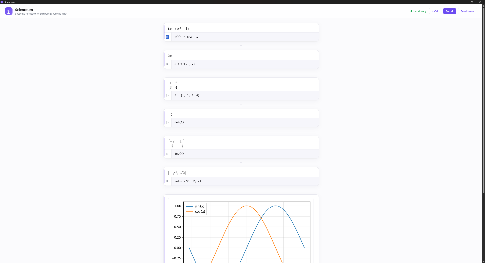
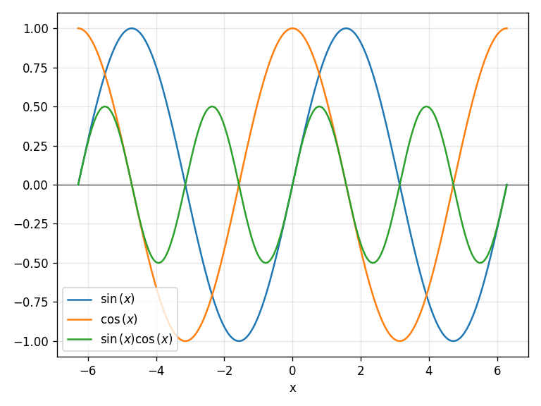

# Scienceum Desktop — a Pluto-style notebook
\
This is a separate repository for the app that is included in the repository **[Scienceum](https://github.com/yossfel/Scienceum/tree/main)**. The app is considered the main interface to use (still not fully developed). For the entire project (in its early development stage), maybe I can work on it from time to time.
The app is a reactive notebook for the **Scienceum language**. Write maths in cells; get
exact symbolic results, numbers, matrices, and inline plots. Light theme.

The app does **not** reimplement the language — it is a thin shell over the
parsers in [`../parsers/python`](../parsers/python). All syntax (expressions,
`f(x) := x^2` definitions, `[1, 2; 3, 4]` matrices, `solve`/`diff`/`plot` …) is
defined and tested there; the app only *presents* their results.

## Architecture

Four layers, each one process/area with a single, narrow contract to the next:

```
┌──────────────────────────────────────────────────────────────┐
│ 1. Web UI            src/index.html · main.js · styles.css     │
│    light Pluto-style notebook; KaTeX renders the LaTeX;        │
│    output is shown ABOVE each code cell; cells share one       │
│    stateful session.                                           │
│        │  window.__TAURI__.core.invoke("eval_cell", { src })   │
│        ▼                                                        │
│ 2. Rust shell        src-tauri/src/main.rs   (Tauri v2)         │
│    owns the OS window + WebView2; holds the sidecar handle      │
│    behind a Mutex so the stateful kernel is serialised;         │
│    relays each request as ONE JSON line.                        │
│        │  stdin/stdout, one JSON object per line                │
│        ▼                                                        │
│ 3. Python sidecar    kernel_server.py                          │
│    long-lived process; the *presentation* layer. Turns a       │
│    kernel result into { latex, text } or an inline base64      │
│    plot, and parser/eval errors into caret-annotated text.     │
│        │  SymbolicKernel.eval(src)                              │
│        ▼                                                        │
│ 4. Language kernel   parsers/python/scienceum/                 │
│    lexer → Pratt parser → AST → SymbolicKernel                 │
│    (SymPy · SciPy · Matplotlib). The real CAS.                 │
└──────────────────────────────────────────────────────────────┘
```

**Request flow for one cell.** You press Shift+Enter → `main.js` calls
`invoke("eval_cell", { src })` → the Rust command locks the sidecar, writes
`{"id":N,"op":"eval","src":...}\n` to its stdin and reads one reply line → the
Python server parses + evaluates with `SymbolicKernel`, formats the result, and
writes the reply → Rust returns the JSON to JS → `main.js` renders it (KaTeX
math, an `` for a plot, or a red caret box for an error).

**Why a Python sidecar (not pure Rust)?** The CAS is SymPy/SciPy/Matplotlib —
Python-only. The Rust layer is the native window + a typed, serialised bridge;
it never does maths itself. (`parsers/rust` is a standalone port of the *parser*
+ numeric kernel; the app does not use it.)

**State.** The kernel is stateful and the Mutex keeps cell evaluations ordered,
so `a = x^2 - 2` in one cell is visible to `solve(a, x)` in the next — exactly
like Pluto. **Reset kernel** rebuilds a fresh environment.

**Contracts (stable seams).**
- UI ⇄ Rust: commands `eval_cell { src }`, `reset_kernel` → JSON value.
- Rust ⇄ Python: line-delimited JSON `{ id, op: "eval"|"reset"|"ping", src? }`
  → `{ id, ok, kind, latex?, text?, image?, error?, detail? }`.

## A cell can hold several lines

A cell is not limited to one statement. Press **Enter** to add a line inside the
editor and **Shift+Enter** to run; every line is evaluated in order against the
shared session and the **last line's value** is shown (Jupyter/Pluto style). A
statement that spans several lines — a multi-line matrix, an unbalanced bracket,
a trailing operator — is rejoined automatically, and an error still points at the
exact line and column inside the cell.

```
a = 3
b = 4
a + b        ← the cell shows 7
```

## Plots are inline — and they accumulate

A `plot(...)` cell returns a PNG, which the sidecar inlines as base64 and the UI
shows as an `` above the cell. Because the kernel is stateful, the plotting
commands **share one figure**: a second `plot` (or `scatter`, `parametric`) in a
later cell *overlays* onto the same picture rather than replacing it. Run a bare

```
separate
```

cell to close that figure so the next plot starts clean. `contour` and `plot3d`
each render their own standalone figure.



So a natural notebook session is: plot a curve, run another `plot` to lay a
second curve over it, `scatter` your data points on top, then `separate` before
moving on to a contour or surface. The full command set (`plot`, `scatter`,
`parametric`, `contour`, `plot3d`, `separate`) and more examples are in
[`../docs/LANGUAGE.md`](https://github.com/yossfel/Scienceum/tree/main/docs/images).

## Run it (development)

Prerequisites:
- Python with the symbolic stack: `pip install -r ../parsers/python/requirements-symbolic.txt`
- Rust toolchain + a WebView2 runtime (preinstalled on Windows 11)
- Node (only to run the Tauri CLI)

```bash
cd app
npm install          # first time only — installs @tauri-apps/cli
npm run dev          # launches the window (cargo builds the Rust shell)
```

`npm run dev` runs `tauri dev`, which serves `src/` and starts the Rust shell,
which in turn launches `python kernel_server.py`.

### If Python isn't found
The shell calls `python` on PATH. Override it:
```bash
# PowerShell
$env:SCIENCEUM_PYTHON = "C:\path\to\python.exe"; npm run dev
```
You can also point at the kernel script explicitly with `SCIENCEUM_KERNEL`.

## Keyboard

| Key | Action |
|-----|--------|
| `Shift`+`Enter` | run cell, move to (or create) the next |
| `Ctrl`/`Cmd`+`Enter` | run cell in place |
| `Ctrl`/`Cmd`+`Shift`+`Enter` | add a new cell at the end |
| hover a cell | `+` add below · `✕` delete |
| **+ Cell** (top bar) / **+ Add cell** (foot) | add a cell |

## Layout

```
app/
  kernel_server.py        Python stdio JSON server wrapping SymbolicKernel
  src/                    frontend (static — no bundler)
    index.html  main.js  styles.css
  src-tauri/              Rust shell (Tauri v2)
    src/main.rs           spawns + relays to the sidecar
    tauri.conf.json  capabilities/  icons/
```

## Packaging note
`npm run build` produces an installer for the Rust shell, but **bundling the
Python interpreter + SymPy is out of scope** for this dev setup — a shipped app
would need an embedded/py-installer kernel or a Rust-native CAS. For now the app
targets local development where `python` is on PATH.

See [`../docs/LANGUAGE.md`](../docs/LANGUAGE.md) for the language reference.
In a future update, the app will probably be integrated into an installer, making it easier to use as an app (notebook) for  algebraic (Math/physical) and numerical manipulation.